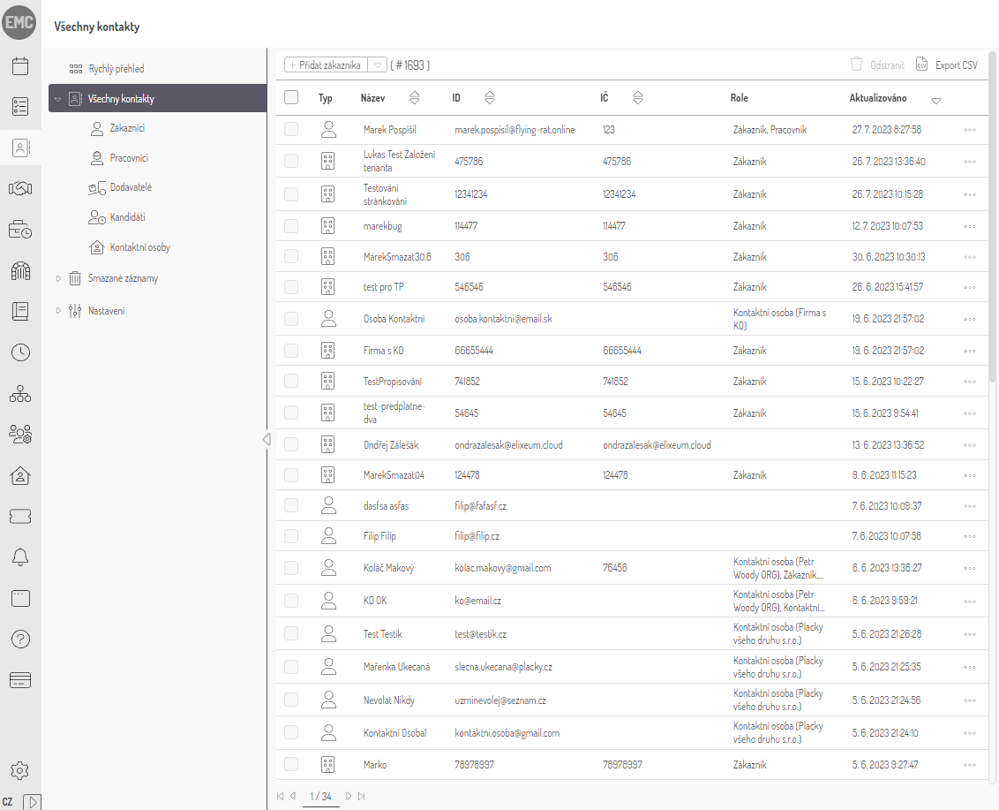

We recently made the strategic decision to completely transform and enhance the User Interface (UI) of our Portal, which can be accessed at [https://portal.elixeum.cloud/](https://portal.elixeum.cloud/). This significant change was prompted by the realization that our current UI lacked consistency and did not align with the sleek and modern designs commonly seen in leading web applications. In order to address this issue, we embarked on a comprehensive journey of developing and implementing a brand new UI that would not only meet the expectations of our users but also elevate their overall experience.

## First Steps

We started by updating the core grid of the portal. Each time we changed a specific element, it required deleting and rewriting the entire stylesheet. Why? Mainly because these stylesheets were old, making it necessary to rewrite the code from scratch. The code wasn't easy to understand, and sometimes it used not-so-great practices, and so on.

Furthermore, we had to change every CSS class name because we previously used shorthand names like `tbl__cmnds`, which became hard to understand. So, we replaced these shortcuts with more clear class names, such as `table__commands`.

The process of renaming all CSS class names turned out to be more challenging than expected, given our use of the [BEM](https://getbem.com/) CSS class naming methodology. It wasn't the fault of the BEM application itself; rather, our misapplication, incorporating multiple levels of nesting, transformed an initially straightforward concept into a more complex situation over time. This complexity increased when multiple classes were combined, involved [conditional classes](https://vuejs.org/guide/essentials/class-and-style.html), or used [CSS selectors](https://www.w3schools.com/cssref/css_selectors.php). Despite many errors during the "replace all" function in VS Code, we carefully reviewed all changes made during the renaming process to fix any mistakes. While it seems that all classes are now correctly renamed, there might still be hidden issues.

Our systematic redesign involved creating new and clean code for all elements. For example, `<button>` styles were sorted into separate files by button type (`button-base.scss`, `button-circular.scss`, `button-social.scss`, and `button-themed.scss`). Each file had multiple button classes, like the `.button—delete` class in `button-base.scss` or the `.button—themed—delete` class in `button-themed.scss`.

After implementing the new design, we found that some customers found the new elements less readable. (Customers can customize their primary and secondary tenant colors.)

To address this, we came up with an algorithm that improves readability while keeping the new design and minimizing deviations from the original design. This algorithm, implemented in JavaScript, takes the tenant color as a parameter during the initial page load and checks whether the color is dark enough. The function extracts the red, green, and blue components of the provided color using **`substring`** and **`parseInt`** methods, calculates perceived brightness based on a formula reflecting human color perception, and checks if the color meets a defined brightness threshold of 60%.

To further enhance performance, we adopted a strategy of doing the contrast calculation once at application start. The calculated value is stored as a CSS variable, allowing it to be easily accessed and applied across the application without the need for live per-element calculations. This not only ensures consistent readability improvements but also minimizes the impact on performance that would have been incurred by live per-element calculations.

If the color is considered 'dark,' the code proceeds with the **`darkenColor`** function, which adjusts the color's intensity by multiplying the red, green, and blue components with a **`darkenFactor`** of 0.55 and rounds down using **`Math.floor`**.

After completing the core elements like buttons and individual form fields, we moved on to restyling more intricate elements. This involved starting components, like moving the User Menu from the top-left corner to the top-right corner, or adjusting the Language Menu from the bottom-left corner to the top-right corner.

Then, we overhauled the left menu to align with the new design, introducing HTML Template and Layout changes, including a new `SubMenu` element. The `SubMenu` was originally part of the main menu, so the separation was quite challenging to do without breaking any connections with the main menu. The new `SubMenu` can be completely hidden by toggling the menu button, and the main menu is no longer expandable like it was in the UI 2.0.

Because the default HTML titles were appearing after a pretty long delay when hovering the mouse, we also decided that they needed to be changed for a better user experience. Since the delay of default tooltips cannot be modified, we used an existing Vue library called [VueTippy](https://vue-tippy.netlify.app/). However, while replacing all the HTML tooltips with VueTippy tooltips, there was an issue, especially in tables, where the tooltip would scroll away when scrolling. Luckily, VueTippy is quite handy and offers a lot of configurations, so we fixed this issue by making these tooltips follow the user's cursor instead of sticking to the HTML element.

The redesign extended to changing the icon set from thin icons to light icons, updating the Login screen design, and focusing on two pivotal and widely-used portal elements: the `TableView` and the `GenericForm`. While the `GenericForm` required minimal changes, the `TableView` underwent extensive restyling, emphasizing visual enhancements rather than technical modifications.

## Before and After

Before (UI 2.0)

After (UI 3.0)

## TableView

We've implemented a wide range of enhancements in the `TableView`, and when you combine them all, they truly have a significant impact.

To start, we addressed an issue where an excessive number of table cells were causing rows to span across multiple lines. As a result, we have updated the table style to ensure that each row fits neatly into a single line, resulting in a much tidier appearance.

Furthermore, we relocated the action column to the left-hand side of the table. This adjustment proves particularly beneficial in modules such as Contract Planning, where numerous columns are present. Now that all the rows occupy a single line, the columns have become wider, eliminating the need for horizontal scrolling to access the action column.

In addition, we have introduced a third state for the checkbox that selects all the table rows. This enhancement facilitates the management of extensive data sets, providing users with a more streamlined experience.

Alright, so here's the deal. We've gone ahead and carefully matched up all the column titles with the data in each column, making sure everything looks super smooth and visually appealing. Moreover, we have made several additional adjustments to further enhance the overall organization of the table view.

With these comprehensive improvements to the table view now finished, we are now focused on refining other detailed aspects of the user interface. This phase involves diving into the specifics of UI design, carefully ensuring that elements not only look visually appealing but also work smoothly. We may make small adjustments to the HTML and CSS code, and we are also considering using Vue.js to add more interactive elements that enhance the overall user experience.
